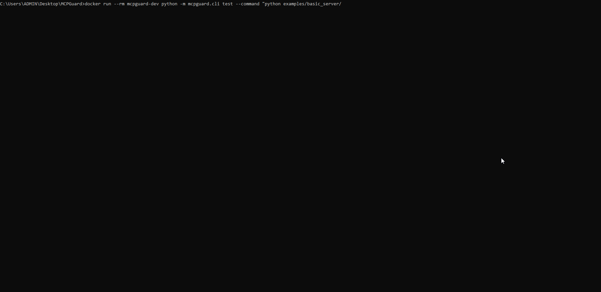

# MCPGuard

**Pre-flight security and contract testing for MCP tools.**

MCPGuard helps teams decide whether an MCP tool is safe enough for agents to call.
It is a trust gate, not just a schema checker.

Tagline: **Test MCP tools before agents trust them.**

[Functions Guide](docs/FUNCTIONS_GUIDE.md) | [Rule Reference](docs/CHECK_RULES.md) | [CLI/Config/CI/Docker](docs/CLI_CONFIG_REFERENCE.md)

<p align="center">
  
</p>

## What MCPGuard Checks

| Check | Status | Purpose |
|---|---|---|
| Schema validation | DONE | Validate input contracts and hard bounds |
| Timeout test | DONE | Prevent tools from hanging agents |
| Fuzz/runtime robustness | DONE | Catch crashes, weak errors, stack-trace leaks |
| Secret leak detection | DONE | Detect API key/token patterns in tool output |
| Permission boundary (file path) | DONE | Enforce tool-level allow_paths/deny_paths probes |
| Prompt injection surface | DONE | Detect unsafe instructions in descriptions/output |
| Side-effect detection | PENDING | Detect unexpected file writes/network calls |

## Threat Model

MCPGuard currently focuses on these threats:
- Tool returns secrets in output.
- Tool accepts overly broad or weakly bounded input.
- Tool ignores timeout expectations.
- Tool crashes or exposes stack traces on malformed input.
- Tool returns low-quality error messages that hide failures.

Planned threat coverage:
- Tool writes files unexpectedly.
- Tool makes outbound network calls unexpectedly.
- Tool description or output contains prompt-injection style instructions.
- Tool output includes hidden instructions meant to steer the agent.

## Non-Goals

MCPGuard does **not** claim the following:
- Full sandbox isolation.
- Replacement for OS/container security.
- Runtime exploit prevention for every attack class.

MCPGuard is a **pre-flight testing and policy validation layer**.

## Quickstart

```bash
python -m pip install -e .[dev]
mcpguard init
mcpguard mcp test basic-demo
```

Generate JSON report:

```bash
mcpguard mcp test basic-demo --format json --output basic-demo-report.json
```

Risk-gated scan (CI style):
```bash
mcpguard mcp test basic-demo --fail-on high
```

## CLI Demo



## 30-Second Failure Demo

Run an intentionally unsafe MCP server:

```bash
mcpguard mcp test vulnerable-demo --config mcpguard.yaml --fail-on high
```

Expected findings include:
- `secret_leaked`
- `timeout_exceeded`
- `path_outside_allowlist`
- `prompt_injection_in_description`
- `prompt_injection_in_output`
- schema quality gaps (for example, missing `maxLength`)

Vulnerable demo source:
- `examples/vulnerable_server/server.py`

JSON demo:
```bash
mcpguard mcp test vulnerable-demo --config mcpguard.yaml --format json
```

## Policy File (`mcpguard.yaml`)

Current policy structure:

```yaml
server:
  command: "python examples/basic_server/server.py"

policy:
  fail_on: "high"

schema:
  require_input_schema: true
  require_descriptions: true
  require_required_fields: true
  require_max_for_numbers: true
  min_description_length: 10

timeout:
  timeout_ms: 10000
  warn_after_ms: 3000

secret:
  enabled: true
  patterns:
    - "OPENAI_API_KEY"
    - "token="

tools:
  read_file:
    allow_paths: ["./docs", "./src"]
    deny_paths: [".env", "~/.ssh"]
    network: false

checks:
  prompt_injection:
    enabled: true
    scan_description: true
    scan_output: true
```

## Severity And Risk Model

Normalized severities:
- `low`
- `medium`
- `high`
- `critical`

Risk score weights:
- `critical = 10`
- `high = 7`
- `medium = 4`
- `low = 1`

`--fail-on` thresholds:
- `low`: fail on low or above
- `medium`: fail on medium or above
- `high`: fail on high or critical
- `critical`: fail only on critical

## JSON Output Schema

`--format json` returns a stable machine-readable object:

```json
{
  "target": "python examples/basic_server/server.py",
  "status": "pass",
  "overall_risk_level": "low",
  "summary": {
    "tools_tested": 1,
    "findings": 0,
    "critical": 0,
    "high": 0,
    "medium": 0,
    "low": 0
  },
  "tools": []
}
```

Planned policy extensions:

```yaml
rules:
  detect_secrets: true
  require_schema: true
  detect_side_effects: true
```

## CI Integration

A ready workflow is included at `.github/workflows/mcpguard.yml`.

Minimal usage in CI:

```bash
mcpguard mcp test basic-demo --fail-on high
```

JSON artifact in CI:

```bash
mcpguard mcp test basic-demo --format json --output mcpguard-report.json
```

## Positioning vs Related Projects

- **RepoBrain**: helps agents understand repositories (context memory/retrieval).
- **MCPGuard**: helps agents decide whether MCP tools are safe to call (trust/security gate).

Portfolio split:
- `RepoBrain` -> codebase memory
- `MCPGuard` -> MCP tool trust/security
- `DecisionGraph` -> reasoning/decision structure
- `MemoryFeed` -> agent memory/events

## Roadmap

High priority:
1. Stronger CLI scan/test/report coverage
2. Tool-level policy (`allow_paths`, network policy)
3. Dangerous side-effect detection (file/network)
4. Vulnerable sample suite + policy tests
5. Network boundary enforcement (`tools.<tool>.network`)

Later:
1. HTML report
2. Risk score breakdown per rule family
3. Permission diff report
4. MCP server fuzz corpus expansion

## Prompt for Missing Features

Use this ready-to-run build prompt to implement the remaining trust-gate features:
- `docs/NEXT_PROMPT.md`

## Included Examples

- `examples/basic_server`: minimal safe MCP server for smoke tests.
- `examples/vulnerable_server`: intentionally unsafe server for failure demos.
